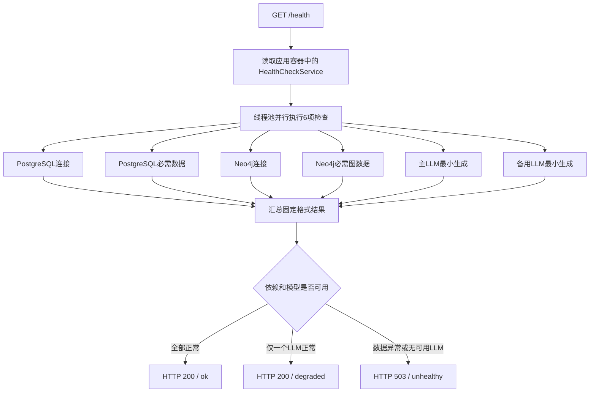

# 健康检查使用与实现逻辑

更新时间：2026-09-11

本文说明本项目健康检查接口的启动方式、调用方法、状态含义、检查范围及代码实现链路。

## 1. 接口选择

| 方法与路径 | 用途 | 是否访问依赖 | 是否调用LLM | 推荐调用场景 |
|---|---|---|---|---|
| `GET /health/live` | 判断HTTP进程是否仍能响应 | 否 | 否 | 高频探活、进程守护、内网穿透可用性检查 |
| `GET /health` | 判断应用能否完成真实业务请求 | 是 | Qwen与DeepSeek各调用一次 | 手工验收、部署后检查、低频定时检查 |

`/health` 每次调用都会产生两次真实LLM请求。不要把它配置成秒级轮询，也不要在没有鉴权或限流时直接暴露到公网。

## 2. 本机启动

以下命令均在项目根目录 `D:\codes\A_mealagent_v3` 下执行。

### 2.1 启动数据库

```powershell
docker compose up -d
docker compose ps
```

正常情况下应看到：

- `mealagent-postgres` 为 `Up`，监听 `127.0.0.1:5432`
- `mealagent-neo4j` 为 `Up`，监听 `127.0.0.1:17687` 和 `127.0.0.1:17474`

三个数据库端口都只绑定本机，不应作为内网穿透入口。

### 2.2 准备LLM配置

项目根目录的 `.env` 至少需要主模型配置：

```dotenv
LLM_PROVIDER=openai
LLM_BASE_URL=<主模型接口地址>
LLM_AUTH_TOKEN=<主模型令牌>
LLM_MODEL=qwen3.8-max
```

备用模型使用以下配置：

```dotenv
LLM_PROVIDER_BACKUP=openai
LLM_BASE_URL_BACKUP=<备用模型接口地址>
LLM_AUTH_TOKEN_BACKUP=<备用模型令牌>
LLM_MODEL_BACKUP=deepseek-v4-flash
```

不要把 `.env`、令牌或包含令牌的请求日志提交到Git。

### 2.3 启动API

```powershell
uv --cache-dir .uv-cache run --no-dev --env-file .env python -m uvicorn backend.api.app:create_app --factory --host 127.0.0.1 --port 8000 --workers 1
```

启动完成后，本机地址为 `http://127.0.0.1:8000`。

## 3. 调用方法

### 3.1 存活检查

PowerShell：

```powershell
curl.exe -i http://127.0.0.1:8000/health/live
```

成功时固定返回HTTP 200：

```json
{"status":"ok"}
```

此结果只能说明FastAPI进程可以响应，不能说明数据库、业务数据或LLM可用。

### 3.2 完整健康检查

```powershell
curl.exe -i http://127.0.0.1:8000/health
```

全部正常时返回HTTP 200，例如：

```json
{
  "status": "ok",
  "checked_at": "2026-09-11T04:02:36.954880+00:00",
  "duration_ms": 1600,
  "available_models": [
    "qwen3.8-max",
    "deepseek-v4-flash"
  ],
  "checks": {
    "postgresql": {"status": "ok", "duration_ms": 163},
    "postgresql_data": {"status": "ok", "duration_ms": 201},
    "neo4j": {"status": "ok", "duration_ms": 150},
    "neo4j_data": {"status": "ok", "duration_ms": 1594},
    "llm_primary": {
      "status": "ok",
      "duration_ms": 999,
      "model": "qwen3.8-max"
    },
    "llm_backup": {
      "status": "ok",
      "duration_ms": 1013,
      "model": "deepseek-v4-flash"
    }
  }
}
```

字段含义：

| 字段 | 含义 |
|---|---|
| `status` | 应用总体状态：`ok`、`degraded` 或 `unhealthy` |
| `checked_at` | 检查完成时间，UTC ISO 8601格式 |
| `duration_ms` | 本次完整检查的总耗时；各项检查并行执行，因此通常接近最慢单项耗时 |
| `available_models` | 本次真实调用成功的模型名 |
| `checks` | 每个依赖和数据检查的独立结果 |

响应包含 `Cache-Control: no-store`，避免代理或浏览器缓存过期的健康状态。

## 4. 总体状态判定

| 数据库及数据 | 主LLM | 备用LLM | HTTP状态码 | `status` |
|---|---|---|---|---|
| 全部正常 | 正常 | 正常 | 200 | `ok` |
| 全部正常 | 正常 | 异常或未配置 | 200 | `degraded` |
| 全部正常 | 异常 | 正常 | 200 | `degraded` |
| 全部正常 | 异常 | 异常或未配置 | 503 | `unhealthy` |
| 任一数据库或数据检查异常 | 任意 | 任意 | 503 | `unhealthy` |

只要数据库和数据完整，并且至少一个LLM能够真实生成，应用就可以继续提供服务。`available_models` 用于说明当时实际可用的模型。

## 5. 各检查项的实现逻辑

### 5.1 `postgresql`

使用应用共享的SQLAlchemy `Engine` 建立连接并执行：

```sql
SELECT 1
```

该项验证地址、端口、账号、密码、数据库名以及基本查询能力。

### 5.2 `postgresql_data`

依次查询以下六张表，每张表至少要存在一行数据：

| ORM模型 | 数据表 | 业务用途 |
|---|---|---|
| `Recipe` | `recipes` | 菜谱基础信息 |
| `Ingredient` | `ingredients` | 食材及营养数据 |
| `RecipeIngredient` | `recipe_ingredients` | 菜谱与食材关系 |
| `RecipeNutrition` | `recipe_nutrition` | 菜谱营养汇总 |
| `UserProfile` | `user_profiles` | 用户健康档案 |
| `ProfileDriTarget` | `profile_dri_targets` | 分餐次营养目标 |

任一表为空都会得到 `data_unavailable`。`dialogue_sessions` 和 `dialogue_turns` 允许为空，因为新部署尚未产生会话也属于正常状态。

### 5.3 `neo4j`

调用Neo4j Driver的 `verify_connectivity()`。该项验证Bolt连接、账号和密码。

### 5.4 `neo4j_data`

执行一次Cypher查询，要求以下图数据均存在：

- `Recipe` 节点
- `Ingredient` 节点
- `Concept` 节点
- `part_of` 关系
- `is_a` 关系

缺少任一类节点或关系都会得到 `data_unavailable`。

### 5.5 `llm_primary` 与 `llm_backup`

主模型和备用模型使用各自独立的客户端，并行发送：

```text
健康检查，请仅返回 OK
```

每个客户端配置为：

- 最多输出8个token
- 单次请求超时30秒
- 不自动重试
- 关闭思考模式或使用最低推理强度

返回文本去掉首尾空白及常见句末标点后，必须等于 `OK`。仅成功建立客户端并不代表模型可用，必须完成这次真实生成。

## 6. 执行链路



FastAPI路由只负责取得检查结果并映射HTTP状态码。探测动作由基础设施层实现，总体状态由 `HealthCheckService` 统一计算。

## 7. 失败响应与错误码

失败项不会返回上游异常原文、数据库地址、LLM接口地址或认证令牌，只会返回固定错误码：

| `error_code` | 含义 | 常见检查方向 |
|---|---|---|
| `dependency_unavailable` | PostgreSQL或Neo4j无法连接 | 容器状态、端口、账号、密码、连接配置 |
| `data_unavailable` | 必需关系库数据或图数据缺失 | 数据导入结果、表是否为空、图节点和关系数量 |
| `llm_unavailable` | LLM超时、认证失败、限流、服务异常或没有返回`OK` | `.env`、Provider控制台、额度和模型名 |
| `configuration_missing` | 未完整配置备用LLM | 三个 `LLM_*_BACKUP` 变量 |

这种响应方式可以避免公网调用者从健康接口获取内部连接信息。详细原因需要在服务器本机结合容器状态和Provider控制台排查。

## 8. 主备模型在业务请求中的行为

健康检查会独立列出两个模型的可用性。实际业务请求仍优先调用主模型，以下情况会切换到备用模型：

- 主模型调用阶段抛出异常
- 主模型无法创建结构化输出调用

如果备用模型本身无法创建结构化输出，主模型仍可继续工作。如果主模型和备用模型都失败，备用模型异常会继续交给约束提取层处理；认证、限流、超时及Provider服务错误会映射为HTTP 503。

主备切换只对当前这一次业务调用生效，不会永久更改主模型配置；下一次请求仍先尝试主模型。

## 9. 内网穿透使用建议

SakuraFrp应只转发API端口 `127.0.0.1:8000`。

- 高频监控使用 `/health/live`
- 部署后或人工验收使用 `/health`
- 公网开放 `/health` 前增加访问认证或限流
- 不转发PostgreSQL的5432端口或Neo4j的17474、17687端口

`/health/live` 返回正常但业务请求失败时，再手工调用 `/health`，根据失败项定位依赖。

## 10. 相关代码

| 文件 | 职责 |
|---|---|
| `backend/api/app.py` | `/health`、`/health/live` 路由及HTTP状态码映射 |
| `backend/application.py` | 创建健康检查服务并注入应用容器 |
| `backend/services/health_check.py` | 并行调度检查、汇总耗时、计算总体状态 |
| `backend/infrastructure/health.py` | PostgreSQL、Neo4j、业务数据和LLM探测实现 |
| `backend/infrastructure/llm/langchain_constraints.py` | 健康检查专用模型参数及业务主备切换 |
| `tests/Spec_14_对外服务接口/test_健康检查.py` | 健康状态、HTTP映射和信息脱敏测试 |
| `tests/test_约束服务LLM主备切换.py` | 主备模型切换测试 |
